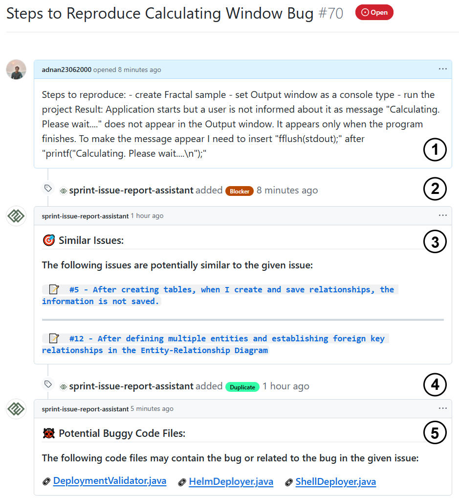
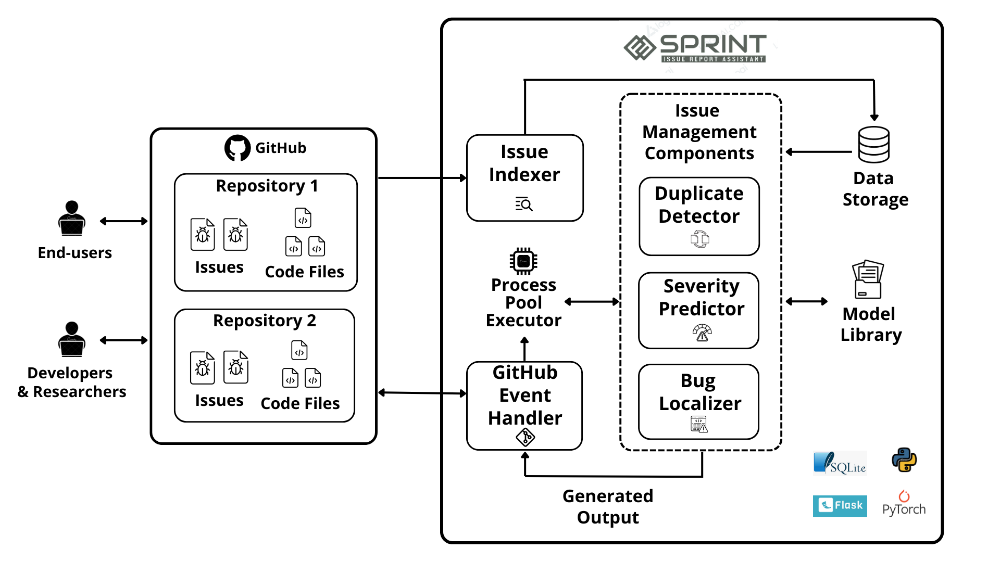

<p align="center">
  
</p>

<h1 align="center">SPRINT (iSsue rePoRt assIstaNT)</h1>

## What is SPRINT?

SPRINT is an open-source GitHub application that acts as an issue management assistant for developers, project managers, computer science students, and educators. SPRINT has 3 features:
1. Identifying similar issues  
2. Predicting issue severity  
3. Locating potential buggy code files  

---

## Install SPRINT:

SPRINT can be installed as a GitHub app on any GitHub repository. The installation link of SPRINT is given below, using which a user can install SPRINT on one or many repositories.

:link: [Install SPRINT](https://github.com/apps/sprint-issue-report-assistant)

---

## About this Repository

This repository hosts the code, resources, and supporting materials for the **SPRINT Tool**. It is organized into the following folders:

### Replication Package
This folder contains all materials necessary to replicate the experiments, evaluations, and studies conducted for SPRINT. It is further divided into the following subfolders:
- **Evaluation**: Includes model fine-tuning scripts, evaluation guidelines, and results for the three main features of SPRINT.
- **SPRINT Test Cases**: Provides sample test cases to test the three features of SPRINT.
- **User Study**: Contains the user study questionnaire and survey results related to SPRINT.

### SPRINT Tool
This folder contains the core codebase for the SPRINT tool. The accompanying `README.md` file provides detailed instructions on how to run and customize SPRINT to suit your requirements.

### assets
This folder holds images and other utility files used throughout the repository, including visuals for documentation purposes.

Feel free to explore these folders for a comprehensive understanding of SPRINT and its functionality.

---

## SPRINT in Action:

<p align="center">
  
</p>

When a new issue is reported, SPRINT fetches that issue and analyzes it. After analysis, SPRINT generates comments and labels for its three features:

1. **Similar Issue Detection**:  
   SPRINT generates a comment containing the list of potential similar issues' (if any) ID, title, and URL. Users can click on that URL to inspect the issues further. If one or more similar issues exist, SPRINT labels the reported issue as "Duplicate".

2. **Severity Prediction**:  
   SPRINT classifies the reported issue into one of five severity levels:
   - **Blocker**: Issue stops all operations; requires immediate resolution.
   - **Critical**: Issue causes major failure; disrupts core functionality.
   - **Major**: Issue affects primary features but has workarounds.
   - **Minor**: Issue impacts secondary features; low operational impact.
   - **Trivial**: Issue has minimal or cosmetic effects only.

   After classifying the severity level, SPRINT creates a label of that severity and attaches it to the reported issue.

3. **Bug Localization**:  
   SPRINT generates a comment containing a list of code files along with their URLs that likely require modification to solve the issues. The code file URLs can take the users to the respective code files for further inspection. 

---

## SPRINT's Architecture:

SPRINT is implemented using Python's Flask framework under the following architecture:  

<p align="center">
  
</p>


1. **Issue Indexer**:  
   - Fetches and stores existing issues in a local database for efficient access and analysis.  
   - Applies page-based indexing to partition issues for efficient fetching.  

2. **GitHub Event Listener**:  
   - Monitors new issues using GitHub Webhooks and fetches them for processing.  
   - Sends the reported issues and code files to other components for further analysis.
   - Formats the output of the feature components and send them back to GitHub.  

3. **Issue Management Component**:  
   - Identifies duplicate issues by analyzing textual similarity.  
   - Classifies reported issues into five severity levels: blocker, critical, major, minor, or trivial.  
   - Predicts potential buggy code files that might require modification to solve the issue.

6. **Other Utilities**:  
   - **Process Pool Executor**: Enables multiprocessing to analyze issues concurrently for faster processing.  
   - **Data Storage**: SPRINT uses a local relational database to store and index issues for efficient fetching and synchronization with GitHub.  
   - **Model Library**: Leverages fine-tuned machine learning models for text analysis and predictions.  


--- 

## How can I contribute to SPRINT?

We are more than happy to receive your contributions (any kind of contributions). If you have an idea of a feature or enhancement, or if you find a bug, please open an issue (or a pull request). If you have questions, feel free to contact us: <a href="https://github.com/adnan23062000">Ahmed Adnan</a> (bsse1131@iit.du.ac.bd),  <a href="https://github.com/antu-saha">Antu Saha</a> (asaha02@wm.edu), and <a href="">Oscar Chaparro</a> (oscarch@wm.edu)

---
  
## How do I customize and run SPRINT on my server?
SPRINT is a tool for bug report duplicate detection, severity prediction and bug localization. A user can run SPRINT and customize it by following the instructions given below. We have also made our .env file public so that users can get an idea of which variable names to use and which values are required in those variables.

**Step 1:** 

Clone the repository 

**Step 2:** 

Download the Models 

You can download our fine-tuned models for the 3 features from here: [models](https://drive.google.com/drive/folders/1IQdWRwUKVGmU-8p4PNbWd4vTxIAuaoNY?usp=sharing). 

After downloading, put them in your preferable location and add the location path (the path of the downloaded folders with feature names; e.g. 'modelDupBr', 'modelPrioritySeverity') in the `.env` file. Add model paths for each of the 3 features in the `.env` file in variables ''DUPLICATE_BR_MODEL_PATH', 'SEVERITY_PREDICTION_MODEL_PATH', 'BUGLOCALIZATION_MODEL_PATH'.

You can also use your own fine-tuned models. You just need to add your model path in the `.env` file.

[n.b. - The bug localization model (Llama-7b-chat-finetune) requires a GPU of the ampere family to load the shards to run, the entire project and the models require about 20gb of space]


**Step 3:**

Install ngrok from (https://ngrok.com/download) [This will create a secure tunnel from a public endpoint (Github repository) to a locally running network service (our project running in localhost)]


**Step 4:** 

Create a new GitHub application. You need to go to the following path:

   `Settings -> Developer's Settings -> New GitHub App`

Make sure in ‘Repository Permissions’ section of the GitHub application, there is Read and Write access to ‘Actions’, ‘Webhooks’ and ‘Issues’. After saving the GitHub application, there will be an option to Generate a private access token (this token will enable permission for SPRINT to fetch and post data to a user’s Github repositories). Generate this token and then copy and paste app id, client id, and github private access token/private key to the `.env` file of the cloned code.


**Step 5:**  

Open the cloned project in IDE and install the required dependencies. You can use our [requirements.txt](https://github.com/sea-lab-wm/sprint_issue_report_assistant_tool/blob/main/SPRINT%20Tool/requirements.txt) file for this. Then, run the following 2 commands in 2 different terminals:  

```bash
ngrok http 5000

python main.py
# or
python -m main
```


**Step 6:**

Go to the repository where you need to run the tool. Go to -

`Settings -> Webhooks -> Add Webhook `

Then copy the forwarding address shown after running the command `ngrok http 5000` or `./ngrok http 5000` (if ngrok.exe is in your SPRINT Tool folder)  into the Payload URL section of Add Webhook. 


Make sure ‘Which events would you like to trigger this webhook?’ section has ‘Issues’, ‘Issue Comments’ and ‘Labels’ checkboxes checked


**Step 7:**

Create issues in that repository and see SPRINT work

---

# SPRINT API Documentation

## Overview
SPRINT provides three features: **Duplicate Issue Detection**, **Severity Prediction**, and **Bug Localization**. Each feature is implemented as a Python function-based API and can be used within your project. Below is a guide on how to interact with these APIs, the expected inputs, outputs, and how to modify or customize their behavior.

---

## 1. Duplicate Issue Detection

### **Function**
`DuplicateDetection(sent1, sent2, issue_id)`

### **Purpose**
Compares a new issue with an existing one to detect duplicates based on textual similarity.

### **Input Parameters**
- `sent1`: *String*. The title or description of the new issue.
- `sent2`: *String*. The title or description of the existing issue to compare against.
- `issue_id`: *Integer*. The ID of the issue being compared.

### **Output**
- **Returns:** *Integer*  
  - `1`: Duplicate.  
  - `0`: Not a duplicate.

### **Customization**
- **Model Path:** Update the `DUPLICATE_BR_MODEL_PATH` environment variable in `.env` to change the pre-trained model.  
- **Model Hyperparameters:** Modify the tokenizer settings (`max_length`, `padding`) or replace the model architecture if needed.  
- **Parallel Processing:** The APIs support multiprocessing for faster execution using a multiprocessing pool. Customize the `chunkify` logic or the number of processes (`processes=4`) to suit your system’s capabilities.

---

## 2. Severity Prediction

### **Function**
`SeverityPrediction(input_text)`

### **Purpose**
Predicts the severity level of a reported issue based on its textual content.

### **Input Parameters**
- `input_text`: *String*. The combined title and description of the issue.

### **Output**
- **Returns:** *String*. One of the following severity levels:
  - `Blocker`, `Critical`, `Major`, `Minor`, `Trivial`.

### **Customization**
- **Model Path:** Update the `SEVERITY_PREDICTION_MODEL_PATH` in `.env`.  
- **Severity Classes:** Adjust the severity classification mapping in `GetSeverityPriorityClass` if custom labels are needed:
  ```python
  severity_classes = {
      0: "Blocker",
      1: "Major",
      2: "Minor",
      3: "Trivial",
      4: "Critical",
  }


## 3. Bug Localization

### **Function**
`BugLocalization(issue_data, repo_full_name, code_files_list)`

### **Purpose**
Predicts the most likely buggy code files that might require modification to fix the issue.

### **Input Parameters**
- `issue_data`: *String*. The combined title and description of the issue.  
- `repo_full_name`: *String*. The repository’s full name (e.g., `org/repo`).  
- `code_files_list`: *List of Strings*. Paths to all code files in the repository.

### **Output**
- **Returns:** *List of Strings*. File paths for the top 5–6 predicted buggy files.

### **Customization**
- **Model Path:** Update the `BUGLOCALIZATION_MODEL_PATH` in `.env`.  
- **Prompt:** Modify the `prompt` string in the function to adjust the question or context provided to the model.  
- **Quantization Settings:** Fine-tune the `BitsAndBytesConfig` if you need to optimize model performance for specific hardware.

---

### **General Notes**

#### **Environment Configuration**
All three features rely on pre-trained models and their paths are defined in `.env`. SPRINT's three features can support many transformer-based models and LLMs. Update the following environment variables to add your customized model paths:
- `DUPLICATE_BR_MODEL_PATH`  
- `SEVERITY_PREDICTION_MODEL_PATH`  
- `BUGLOCALIZATION_MODEL_PATH`

#### **Model Replacement**
To use custom models:
1. Fine-tune your models for tasks like classification or text similarity.
2. Save the models to a local directory.
3. Update the corresponding model paths in the `.env` file.

---

# Extending SPRINT with New Features

## Overview
SPRINT is designed to be modular and extensible, allowing developers to easily add new features. This guide provides a brief overview of how to create a new feature as a functional API and integrate it into SPRINT.

---

## Steps to Add a New Feature

### 1. **Define the Feature**
Identify the new functionality you want to add. Clearly define:
- **Purpose**: What problem does the feature solve?
- **Inputs**: What data does it require?
- **Outputs**: What will the feature return or produce?

### 2. **Create the Feature Functional API**

1. **Set Up the Model/Logic**
   - If the feature requires a machine learning model, train or fine-tune a model specific to the task.
   - Save the model and its tokenizer in a local directory.
   - Define the model's path in the `.env` file for easy configuration.

2. **Implement the API**
   Write a Python function that encapsulates the feature's logic. Use SPRINT's existing APIs as templates. Ensure:
   - The function accepts clear input parameters.
   - The function processes the inputs and produces outputs efficiently.
   - Proper error handling is included.

3. **Integrate the New Feature into SPRINT**  
   Update the Process Logic  

   Modify the `processIssueEvents.py` file to include calls to the new feature API. All the GitHub issues after fetching can be used from this code file according to the requirements.
   Example:  

   ```python
   # Call the new feature
   new_feature_result = NewFeature(input_issue_data)
   create_comment(repo_full_name, issue_number, new_feature_result)

4. **Add Configuration**

   Add environment variables for the new feature in the .env file (e.g., model paths, hyperparameters).

5.   **Update Outputs**

   Decide how the results from the new feature will be presented. For example:
   - Add comments to GitHub issues.
   - Attach labels based on the feature's output.

---
