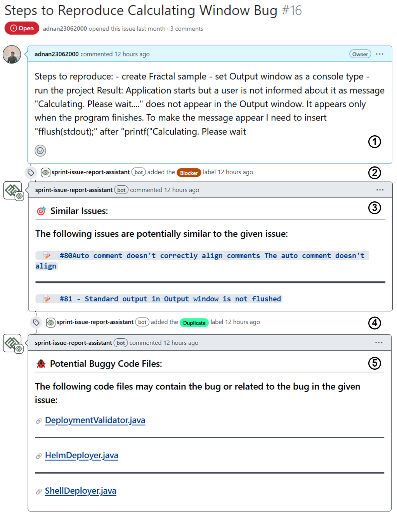

  

<h1 align="center">SPRINT (iSsue rePoRt assIstaNT)</h1>

## What is SPRINT?

SPRINT is an open-source GitHub application that acts as an issue management assistant for developers, project managers, computer science students, and educators. SPRINT has 3 features:
1. Identifying similar issues  
2. Predicting issue severity  
3. Locating potential buggy code files  

---

## Install SPRINT:

SPRINT can be installed as a GitHub app on any GitHub repository. The installation link of SPRINT is given below, using which a user can install SPRINT on one or many repositories.

:link: [Install SPRINT](https://github.com/apps/sprint-issue-report-assistant)

---

## SPRINT in Action:

  

When a new issue is reported, SPRINT fetches that issue and analyzes it. After analysis, SPRINT generates comments and labels for its three features:

1. **Similar Issue Detection**:  
   SPRINT generates a comment containing the list of potential similar issues' (if any) ID, title, and URL. Users can click on that URL to inspect the issues further. If one or more similar issues exist, SPRINT labels the reported issue as "Duplicate".

2. **Severity Prediction**:  
   SPRINT classifies the reported issue into one of five severity levels:
   - **Blocker**: Issue stops all operations; requires immediate resolution.
   - **Critical**: Issue causes major failure; disrupts core functionality.
   - **Major**: Issue affects primary features but has workarounds.
   - **Minor**: Issue impacts secondary features; low operational impact.
   - **Trivial**: Issue has minimal or cosmetic effects only.

   After classifying the severity level, SPRINT creates a label of that severity and attaches it to the reported issue.

3. **Bug Localization**:  
   SPRINT generates a comment containing a list of code files along with their URLs that likely require modification to solve the issues. The code file URLs can take the users to the respective code files for further inspection. 

---

## SPRINT's Architecture:

SPRINT is implemented using Python's Flask framework under the following architecture:  

  

1. **Issue Indexer**:  
   - Fetches and stores existing issues in a local database for efficient access and analysis.  
   - Applies page-based indexing to partition issues for efficient fetching.  

2. **GitHub Event Listener**:  
   - Monitors new issues using GitHub Webhooks and fetches them for processing.  
   - Sends the reported issues and code files to other components for further analysis.
   - Formats the output of the feature components and send them back to GitHub.  

3. **Issue Management Component**:  
   - Identifies duplicate issues by analyzing textual similarity.  
   - Classifies reported issues into five severity levels: blocker, critical, major, minor, or trivial.  
   - Predicts potential buggy code files that might require modification to solve the issue.

6. **Other Utilities**:  
   - **Process Pool Executor**: Enables multiprocessing to analyze issues concurrently for faster processing.  
   - **Data Storage**: SPRINT uses a local relational database to store and index issues for efficient fetching and synchronization with GitHub.  
   - **Model Library**: Leverages fine-tuned machine learning models for text analysis and predictions.  

